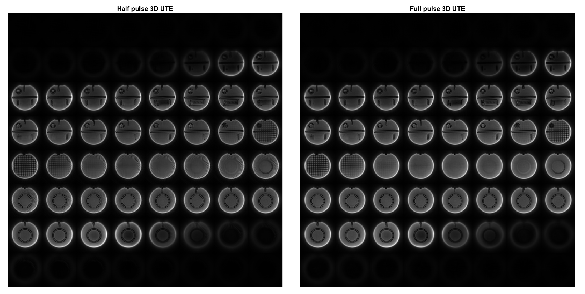

# Summary
We have recently reported the implementation of open-source Ultra-short Echo Time (UTE) sequences [@minTEismrm2022] with PyPulseq [@ravi2018pulseq; @ravi2019pypulseq] for Magnetic Resonance Imaging (MRI). The ``minTE`` repository details the source code and implementations for these minimal Echo Time (TE) sequences. Three customizable sequence variations were made available in the Pulseq format [@layton2017pulseq].

## Sequences
Each sequence can be generated with a Python function using custom input parameters. 

* 2D UTE: a 2D radiofrequency-spoiled (RF-spoiled) radial Gradient Recalled Echo (rGRE) sequence. The k-space trajectory consisted of spokes that 
can be rewound to any point between $k = -k_{max}$ and $k = 0$. Rewinding preserves the $k = 0$ point but increases the minimum TE. The number of spokes followed the Nyquist criterion [@brown2014magneticC14]. A sinc slice-selective RF pulse was used for excitation with two options: full-pulse and half-pulse. The latter used two excitations per spoke with halved pulse duration and opposite slice selective gradients [@nielsen1999ultra] (see \autoref{fig:halfpulse}). This allows the sequence to achieve a shorter TE but also doubles the acquisition time. In both versions, RF spoiling with an increment of 117 degrees [@zur1991spoiling] was employed to allow shorter Repetition Times (TRs). Example parameters using the half pulse option were TR = 15 ms, TE = 449 us, flip angle (FA) = 10 degrees, Field-Of-View (FOV) = 253 mm, slice thickness = 5 mm, and matrix size = 256 x 256. Example images are shown in \autoref{fig:2dute}. 

* 3D UTE: a 3D RF-spoiled rGRE sequence. The k-space trajectory was similar to 2D UTE but with spokes in all directions in 3D space with equal azimuthal and polar angle spacing. Example parameters using the half pulse technique were TR = 15 ms, TE = 119 us, FA = 10 degrees, FOV = 250 mm, slab thickness = 253 mm, and matrix size = 64 x 64 x 64. Example images are shown in \autoref{fig:3dute}.

* CODE: a version of the COcurrent Dephasing and Excitation(CODE) sequence [@park2012short], this implementation used the same gradient axis for both slab selection and readout. Slab excitation happened at a different 3D orientation for each readout and covered the FOV of interest in all directions. Gaussian RF pulses were used and the k-space sampling was similar to the partially rewound 3D UTE. Example parameters were TR = 15 ms, TE = 320 us, FA = 10 degrees, FOV = slab thickness = 253 mm, and matrix size = 64 x 64 x 64. Example images are shown in \autoref{fig:code}.

## Simulation 
Slice profiles of the half-pulse and full pulse excitation modes are shown in \autoref{fig:halfpulse}. The profiles were generated using the RF simulation module of Virtual Scanner 2.0 [@vsjoss; @vsISMRM2022].  

## Reconstruction
Non-cartesian econstruction scripts are provided. The reconstruction is a two-step process: first, pre-processing of the raw data into a form that is sorted as a 2D matrix of size (number of ADC samples, number of readouts) and ready for gridding; second, reconstruction using the NUFFT[@fessler2003nonuniform; @lin2018python] library converts 2D or 3D non-Cartesian data to 2D images or 3D volumes. 

# Statement of Need
UTE sequences visualize tissues with short $T_2$ and $T_2^*$ values. The ability to recover signal from such tissues lends them to musculoskeletal applications such as joint and bone imaging [@holmes2005mrjoint; @jerban2020updatebone]. UTE has also been validated as a non-invasive way of monitoring the lungs of COVID-19 patients [@yang2020clinical]. Complete open-source pipelines of these sequences will help improve the reproducibility of multi-site imaging studies [@tong2022framework; @karakuzu2021vendor; @clarke2020multi]. Sites with the Pulseq interpreter [@layton2017pulseq] or the TOPPE interpreter [@nielsen2018toppe] installed can easily standardize sequences with full transparency of all waveforms. In addition, it promotes access to MRI [@geethanath2019accessible] by providing both customizable sequences and reconstruction code without the need for platform-specific training or access. 
 
# Ongoing Research Projects 
The minTE repository will play a role in the development of MRI methods in inhomogeneous B0 fields which produce short $T_2^*$. Comparsions to state-of-the-art UTE images are needed for sequence families like Multi-Spectral Imaging (MSI) [@MSIreview].

# Acknowledgements
``minTE`` was funded in part by the Seed Grant Program for MR Studies of the Zuckerman Mind Brain Behavior Institute at Columbia University (PI: Geethanath), and was developed at Zuckerman Mind Brain Behavior Institute MRI Platform, a shared resource.

# Figures

# References

